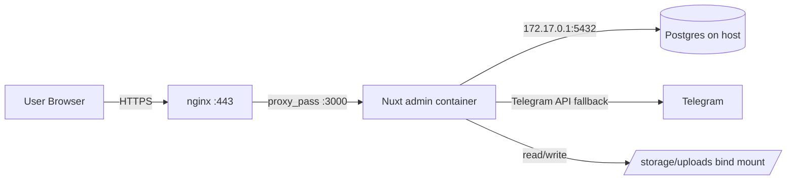

# Architecture

Снимок системы. Когда добавляешь крупную фичу или меняешь инфру — обновляй.

## Overview

cs2-bot-admin — личный flashcard-deck для line-up'ов гранат CS2. SSR-приложение на Nuxt 4, развёрнутое на одном VPS, аутентификация через Telegram Login Widget. Аудитория: 1 владелец + 5 знакомых, не публичный сервис.

NOT a goal: масштаб, market fit, community-фичи (рейтинги, комменты), монетизация.



## Stack

- **Runtime:** Node.js 20 (alpine)
- **Frontend/SSR:** Nuxt 4, Vue 3, Tailwind, `@nuxtjs/i18n` (ru default, en)
- **PWA:** `@vite-pwa/nuxt` (manifest + Service Worker, см. backlog)
- **Database:** PostgreSQL 16 на хосте VPS (см. `decisions.md`)
- **Auth:** Telegram Login Widget + HMAC initData verification
- **Bot (frozen):** Grammy + TypeScript — в репо есть, не деплоим
- **Shared:** `@cs2/shared` — типы, БД-запросы, утилиты

## Repo layout

```
apps/
├── admin/          ← Nuxt — деплоим
└── bot/            ← Grammy — заморожен, не деплоим
packages/
└── shared/         ← @cs2/shared — алиас @shared/*
docs/               ← эта папка
```

Алиас `@shared/* → ../../packages/shared/*` настроен в обоих `apps/*/tsconfig.json`. Импорты `import { getMaps } from '@shared/database'` работают и в исходниках, и после сборки.

## Auth model

```
1. Юзер открывает /admin/login
2. Telegram Login Widget → POST /api/auth/telegram с initData
3. Server валидирует HMAC по BOT_TOKEN
4. Server проверяет user.id ∈ ADMIN_IDS (env, через запятую) — для admin-роли
5. Server создаёт row в users (если нет) с ролью admin/user
6. Server выставляет httpOnly cookie с user_id (signed JWT_SECRET)
```

Защита маршрутов — два контура с allowlist'ами:

1. **Клиент (Nuxt route middleware):** `middleware/auth.global.ts` — глобальный, прогоняется на каждом переходе.
   - `PUBLIC_PATHS = ['/', '/grenades']` → открыто для guest
   - `ADMIN_PATHS = ['/users', '/moderation', '/settings']` → требуют `isAdmin`
   - Всё остальное → требует `isAuthenticated` (иначе redirect на `/login`)
   - `/login` — спецлогика: залогиненный редиректится на `/`
2. **Сервер (Nitro middleware):** `server/middleware/auth.ts` — allowlist по URL: публичные GET-эндпоинты (`/api/grenades`, `/api/maps|sides|...`, `/api/media/*`), user-level (`POST /api/grenades`, `POST /api/media/upload`), всё остальное — admin.

Деф-deny: новый pages-маршрут или API-эндпоинт без явного allowlist-правила автоматически требует auth (или admin для server). Это сознательный выбор после party mode — забыть `definePageMeta({ middleware })` слишком легко.

Роли: `admin` / `user` / `guest`. Source of truth — таблица `users` (см. memory `project_roles.md`).

## Data model

| Таблица | Назначение |
|---|---|
| `maps`, `sides`, `lines`, `difficulties`, `grenade_types` | справочники |
| `smokes` | линапы (FK на все справочники) |
| `granade_media` | Telegram file_id + локальный путь + порядок |
| `users` | Telegram user_id + role |
| `user_grenade_progress` | (user_id, grenade_id, status) — для flashcard-фичи (планируется) |

Bootstrap-схема — `packages/shared/database/database.ts:initDatabase()`. Запускается при старте приложения. **Это не migrations** — это idempotent CREATE TABLE IF NOT EXISTS. Реальные миграции (ALTER) — пока не нужны, при первой ALTER переедем на `node-pg-migrate` (см. tech debt).

## Media pipeline

Двухрежимный resolver в `server/utils/storage.ts`:

1. **Локальный путь** (приоритет): `${STORAGE_PATH}/<file_id>.<ext>` — bind mount в контейнере на `/app/storage/uploads`.
2. **Telegram fallback**: если локального файла нет, тянем через Telegram Bot API по `file_id`. Нужен `BOT_TOKEN` (даже когда бот заморожен).

Bot-процесс не нужен — admin сам делает HTTP-запросы к Telegram API.

`STORAGE_PATH` — env, дефолт `./storage/uploads` (для локалки), в проде — `/app/storage/uploads`.

## PWA

Через `@vite-pwa/nuxt` (`registerType: 'autoUpdate'`).

**Manifest** — `apps/admin/nuxt.config.ts → pwa.manifest`. Иконки: `public/icons/logo-small.png` (192×192) и `public/icons/logo-large.png` (512×512, плюс maskable). `start_url: '/'`, `display: 'standalone'`, `theme_color: '#0d0f14'`.

**Workbox runtime caching** (порядок важен — первый матч выигрывает):

| Pattern | Strategy | Зачем |
|---|---|---|
| `/api/auth/*` | `NetworkOnly` | Логин и cookie — без оффлайна, без устаревших данных |
| `/api/me/*` | `NetworkOnly` | Личный прогресс должен быть свежим, чтобы не мерджить |
| `/api/media/*` | `CacheFirst` (300 entries, 30 дней) | `file_id` immutable, файл по нему не меняется |
| `/api/*` (остальное) | `StaleWhileRevalidate` | Каталог гранат — мгновенный отклик + фоновое обновление |
| Precache (build) | — | App shell (`js/css/html/svg/png/ico/woff2`) |

**Navigation fallback:** `/` (precache'd shell). Denylist: `/api/*`, `/login` — на них не подменяем.

**Что работает offline:** главная + просмотр уже посмотренных гранат с медиа.
**Что не работает:** логин (нужен Telegram-widget с CDN), добавление гранаты (POST уйдёт в network error), сохранение прогресса (тоже POST/PUT). Background sync для прогресса не реализован — потенциальный backlog.

**Dev:** `pwa.devOptions.enabled = false` — SW в dev мешает HMR. Если нужен debug кэшей — временно ставь в `true`.

## Infrastructure

- **VPS:** один Hetzner-style инстанс (144.91.73.230), Ubuntu 24.04
- **nginx:** на хосте, vhost `cs2.awawa-chef.com` → `proxy_pass http://127.0.0.1:3000`
- **TLS:** Let's Encrypt через `certbot --nginx`
- **Postgres:** хостовый (см. decisions.md), коннект из контейнера через `host.docker.internal` (= `172.17.0.1`)
- **Storage:** bind mount `/opt/cs2-bot/storage/uploads` → `/app/storage/uploads`
- **Domain:** `cs2.awawa-chef.com` (Namecheap)

Соседний проект `food-bot` живёт на той же VPS, использует тот же nginx и Postgres. Не трогаем.

## Deploy pipeline

```
push main → GH Actions →
    docker build → push ghcr.io/abuyuk10/cs2-bot-admin:${{ github.sha }} →
    SSH root@144.91.73.230 →
    cd /opt/cs2-bot && docker compose pull && docker compose up -d
```

Подробности — `deployment.md`. Rollback — пин предыдущего sha в `docker-compose.yml`, `up -d`.

## Known tech debt

- `initDatabase()` — bootstrap, не миграции. Переезжаем на `node-pg-migrate` при первой реальной `ALTER`.
- Тестов нет (`apps/bot/jest.config.js` есть, тестов нет).
- Бот-state-machines (`chatStates`, `filterStates`) — in-memory `Map`. Релевантно если разморозим бота на нескольких инстансах (сейчас инстанс один).
- HA нет: один VPS, один контейнер. Для 6 юзеров и не нужно.
- `STORAGE_PATH` ещё хардкоднут в коде в нескольких местах (см. task #5).
